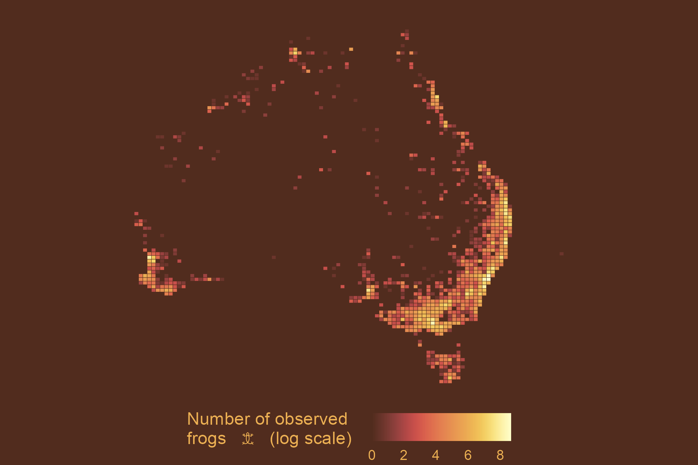
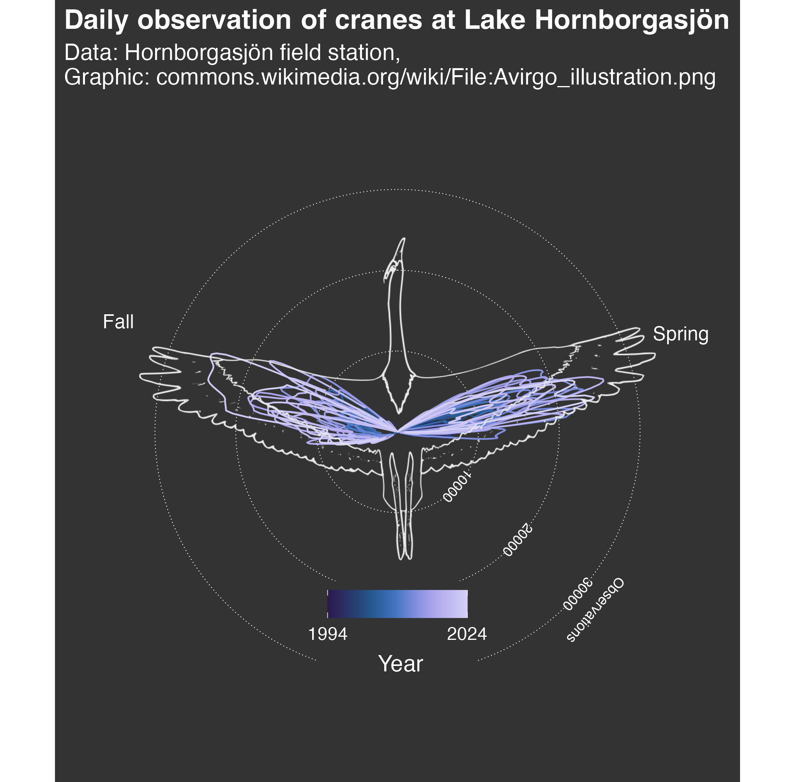

## TidyTuesday Contributions

This repository contains my weekly contributions to the [#TidyTuesday](https://github.com/rfordatascience/tidytuesday) project, where I explore data visualization techniques using R and the tidyverse.

### Featured Visualizations

  
  
  

(*click to enlarge*)

### About TidyTuesday

TidyTuesday is a weekly data project aimed at the R ecosystem. Each week, a new dataset is released, and participants create visualizations to explore and communicate insights from the data.
