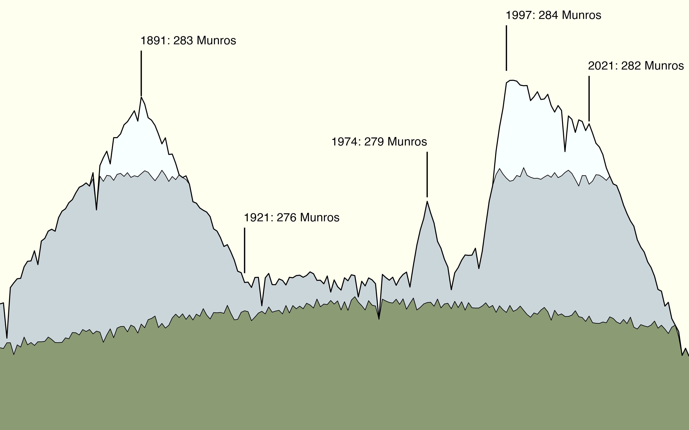
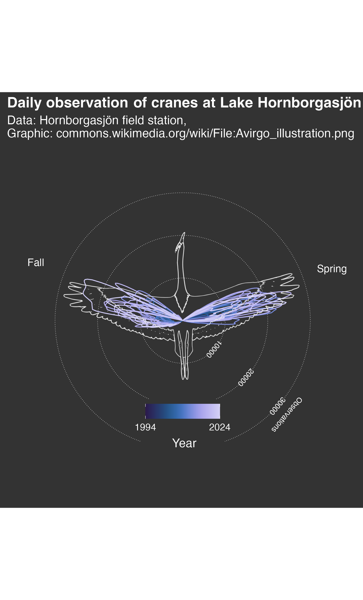

# TidyTuesday Contributions

<!-- Add your intro text here -->
This repository contains my weekly contributions to the [#TidyTuesday](https://github.com/rfordatascience/tidytuesday) project, where I explore data visualization techniques using R and the tidyverse.

---

## Featured Visualizations
<table style="border-collapse: collapse; border: none;">
<tr>
<td width="33%" style="border: none; padding: 8px;">

</td>
<td width="33%" style="border: none; padding: 8px;">

</td>
<td width="33%" style="border: none; padding: 8px;">

</td>
</tr>
</table>

---

## About TidyTuesday

TidyTuesday is a weekly data project aimed at the R ecosystem. Each week, a new dataset is released, and participants create visualizations to explore and communicate insights from the data.

**Connect with me:**
- GitHub: [@lucialayr](https://github.com/lucialayr)

---

*Last updated: November 2025*